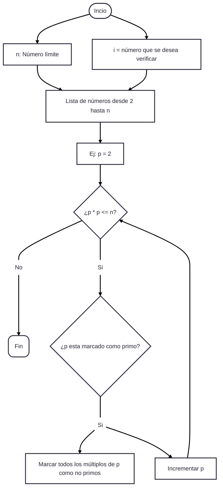

# Reto 3
## Pseudocódigo:
```
Paso 1: Definir n como entero.

Paso 2: Escribir "Ingrese el número límite n:"

Paso 3: Leer n.

Paso 4: Crear una lista de números desde 2 hasta n, marcándolos como primos inicialmente.

Paso 5: Definir p = 2.

Paso 6: Mientras (p * p <= n) hacer:

Paso 6.1: Si p está marcado como primo, entonces:

Paso 6.1.1: Marcar todos los múltiplos de p (desde p * 2 hasta n) como no primos.

Fin

Paso 6.2: Incrementar p en 1.

Fin
```

## Diagrama de flujo:

